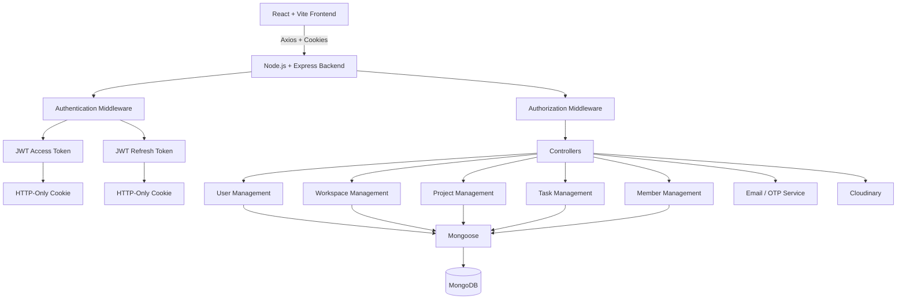

# TaskFlow: Collaborative Project & Task Management Platform


**TaskFlow** is a modern full-stack collaborative project and task management platform designed to help individuals and teams organize, manage, and track their work efficiently.

The platform provides a structured environment for managing **users, workspaces, projects, tasks, members, authentication, and team collaboration** through a secure and scalable REST API architecture.

TaskFlow combines a modern **React + Vite frontend** with a modular **Node.js + Express backend**, **MongoDB/Mongoose** persistence, JWT-based authentication using **HTTP-only cookies**, OTP verification, role-based authorization, Cloudinary file management, and email-based account workflows.

The application is designed with a strong focus on **security, modularity, maintainability, scalability, and a clean developer experience**.

---

## Table of Contents

- [Core Capabilities & Features](#core-capabilities--features)
- [System Architecture](#system-architecture)
- [Technology Stack](#technology-stack)
- [Project Architecture](#project-architecture)
- [Complete Project Structure](#complete-project-structure)
  - [Frontend Structure](#frontend-structure)
  - [Backend Structure](#backend-structure)

- [Authentication & Security](#authentication--security)
- [Role-Based Access Control](#role-based-access-control)
- [Workspace Management](#workspace-management)
- [Project Management](#project-management)
- [Task Management](#task-management)
- [Team & Member Management](#team--member-management)
- [API Architecture](#api-architecture)
- [Database Architecture](#database-architecture)
- [Frontend Architecture](#frontend-architecture)
- [Backend Architecture](#backend-architecture)
- [Environment Configuration](#environment-configuration)
- [Getting Started](#getting-started)
- [API Development Workflow](#api-development-workflow)
- [API Testing](#api-testing)
- [Security Practices](#security-practices)
- [Future Roadmap](#future-roadmap)
- [Contributing](#contributing)
- [License](#license)
- [Author](#author)
- [Support](#support)

---

## Core Capabilities & Features

### 1. Authentication & Account Security

TaskFlow provides a complete authentication system based on **JWT access and refresh tokens stored in HTTP-only cookies**.

#### Authentication Features

- User registration
- User login
- User logout
- JWT access tokens
- JWT refresh tokens
- HTTP-only authentication cookies
- OTP-based email verification
- Password hashing using `bcrypt`
- Forgot password
- Reset password
- Protected routes
- Guest routes
- User profile management
- Automatic access-token refresh

The frontend authentication state is managed through `AuthContext`, while protected and guest navigation is handled through dedicated route guards.

---

### 2. Workspace Management

A **Workspace** represents the primary collaboration boundary in TaskFlow.

Each workspace can contain:

- Owner
- Members
- Member roles
- Projects
- Tasks

```text
Workspace
│
├── Owner
│
├── Members
│
├── Projects
│
└── Tasks
```

---

### 3. Project Management

Projects organize related tasks inside a workspace.

TaskFlow supports:

- Project creation
- Project retrieval
- Project updates
- Project deletion
- Workspace-project relationships
- Project task organization
- Project ownership
- Project access control

Example:

```text
Workspace: Development
│
├── Website Redesign
│   ├── UI Design
│   ├── Frontend Development
│   └── Deployment
│
└── Mobile Application
    ├── Authentication
    ├── Dashboard
    └── Notifications
```

---

### 4. Task Management

Tasks represent individual units of work.

A task can contain:

- Title
- Description
- Status
- Priority
- Due date
- Assignee
- Project
- Workspace
- Labels
- Attachments
- Creator
- Timestamps

#### Task Lifecycle

```text
TODO
 │
 ▼
IN PROGRESS
 │
 ▼
REVIEW
 │
 ▼
COMPLETED
```

#### Priority

```text
LOW
MEDIUM
HIGH
```

---

### 5. Team & Member Management

TaskFlow supports collaborative workspaces through member management.

| Role       | Description                |
| :--------- | :------------------------- |
| **Owner**  | Full workspace control     |
| **Admin**  | Administrative permissions |
| **Member** | Standard workspace access  |

Permissions are enforced on the backend so users cannot bypass restrictions simply by modifying frontend requests.

---

### 6. Task Labels

Tasks can be categorized using labels.

Example labels:

```text
Frontend
Backend
Bug
Feature
Testing
Documentation
Urgent
```

Labels provide an additional layer of task organization and filtering.

---

### 7. File Attachments

TaskFlow supports task-related file attachments through cloud storage.

```text
Attachment
│
├── File Name
├── File URL
├── Public ID
├── Resource Type
├── File Type
└── File Size
```

**Cloudinary** is used for managing uploaded assets.

---

### 8. Dashboard & Productivity

The frontend provides a dedicated dashboard environment containing:

- Dashboard overview
- Projects
- Tasks
- Team
- Notifications
- Settings
- Workspace information

This provides users with a centralized interface for monitoring and managing their work.

---

## System Architecture

TaskFlow follows a modular full-stack architecture separating the frontend, API layer, authentication, business logic, and database.



### Request Lifecycle

```text
React Component
      │
      ▼
Service Layer
      │
      ▼
Axios
      │
      │ withCredentials: true
      ▼
Express Route
      │
      ▼
Authentication Middleware
      │
      ▼
Authorization Middleware
      │
      ▼
Controller
      │
      ▼
Mongoose Model
      │
      ▼
MongoDB
      │
      ▼
API Response
      │
      ▼
React UI
```

---

## Technology Stack

| Domain                | Technology        | Purpose                           |
| :-------------------- | :---------------- | :-------------------------------- |
| **Frontend**          | React             | Component-based UI                |
| **Build Tool**        | Vite              | Development and production builds |
| **Styling**           | Tailwind CSS      | Responsive styling                |
| **Animation**         | Framer Motion     | UI animations                     |
| **Icons**             | React Icons       | Interface icons                   |
| **Routing**           | React Router      | Client-side navigation            |
| **Forms**             | React Hook Form   | Form management                   |
| **HTTP Client**       | Axios             | REST API communication            |
| **Backend**           | Node.js           | Server runtime                    |
| **API Framework**     | Express.js        | REST API                          |
| **Database**          | MongoDB           | Data persistence                  |
| **ODM**               | Mongoose          | Database modeling                 |
| **Authentication**    | JWT               | Token authentication              |
| **Token Storage**     | HTTP-only Cookies | Secure token storage              |
| **Password Security** | bcrypt            | Password hashing                  |
| **Verification**      | OTP / Email       | Account verification              |
| **File Storage**      | Cloudinary        | File and image storage            |
| **Version Control**   | Git / GitHub      | Source control                    |

---

## Project Architecture

TaskFlow is divided into two primary applications:

```text
TaskFlow
│
├── Frontend
│   └── React + Vite
│
└── Backend
    └── Node.js + Express
```

The frontend communicates with the backend through the versioned REST API:

```text
Frontend
   │
   │ HTTP / Axios
   ▼
http://localhost:3000/api/v1
   │
   ▼
Backend
   │
   ▼
MongoDB
```

---

# Complete Project Structure

## Frontend Structure

```text
Frontend/
│
├── package.json
├── package-lock.json
├── vite.config.js
├── index.html
│
├── public/
│   └── taskflow-logo.svg
│
├── src/
│   │
│   ├── api/
│   │   └── axios.js
│   │
│   ├── App.jsx
│   ├── main.jsx
│   ├── index.css
│   │
│   ├── assets/
│   │
│   ├── components/
│   │   │
│   │   ├── auth/
│   │   │
│   │   ├── common/
│   │   │   ├── Button.jsx
│   │   │   ├── Input.jsx
│   │   │   ├── Loader.jsx
│   │   │   └── PasswordInput.jsx
│   │   │
│   │   ├── landing/
│   │   │   ├── CTA.jsx
│   │   │   ├── Features.jsx
│   │   │   ├── Hero.jsx
│   │   │   └── HowItWorks.jsx
│   │   │
│   │   ├── layout/
│   │   │   ├── AppSidebar.jsx
│   │   │   ├── Footer.jsx
│   │   │   ├── MainLayout.jsx
│   │   │   └── Navbar.jsx
│   │   │
│   │   ├── project/
│   │   ├── task/
│   │   └── workspace/
│   │
│   ├── constants/
│   │   ├── brand.js
│   │   ├── routes.js
│   │   └── theme.js
│   │
│   ├── context/
│   │   ├── AuthContext.jsx
│   │   └── ThemeContext.jsx
│   │
│   ├── hooks/
│   │   ├── useAuth.js
│   │   └── useTheme.js
│   │
│   ├── layouts/
│   │   └── DashboardLayout.jsx
│   │
│   ├── lib/
│   │   └── utils.js
│   │
│   ├── pages/
│   │   │
│   │   ├── auth/
│   │   │   ├── ForgotPassword.jsx
│   │   │   ├── Login.jsx
│   │   │   ├── Register.jsx
│   │   │   ├── ResetPassword.jsx
│   │   │   └── VerifyOtp.jsx
│   │   │
│   │   ├── dashboard/
│   │   │   ├── Dashboard.jsx
│   │   │   ├── Notifications.jsx
│   │   │   ├── Projects.jsx
│   │   │   ├── Settings.jsx
│   │   │   ├── Tasks.jsx
│   │   │   └── Team.jsx
│   │   │
│   │   ├── landing/
│   │   │   └── Home.jsx
│   │   │
│   │   ├── project/
│   │   ├── task/
│   │   └── workspace/
│   │       └── Workspace.jsx
│   │
│   ├── routes/
│   │   ├── AppRoutes.jsx
│   │   ├── GuestRoute.jsx
│   │   └── ProtectedRoute.jsx
│   │
│   ├── services/
│   │   └── auth.service.js
│   │
│   └── utils/
│
└── .env
```

---

## Backend Structure

The backend follows a modular Express architecture.

```text
Backend/
│
├── config/
│
├── controllers/
│   ├── auth/
│   ├── profile/
│   ├── workspace/
│   ├── project/
│   ├── task/
│   ├── member/
│   └── user/
│
├── middleware/
│   ├── authentication
│   ├── authorization
│   ├── validation
│   └── error handling
│
├── models/
│   ├── User
│   ├── Workspace
│   ├── Member
│   ├── Project
│   ├── Task
│   └── related models
│
├── routes/
│   ├── auth
│   ├── profile
│   ├── workspace
│   ├── project
│   ├── task
│   ├── member
│   └── user
│
├── services/
│   ├── authentication
│   ├── email
│   ├── OTP
│   └── Cloudinary
│
├── utils/
│
├── app.js
├── server.js
├── package.json
├── package-lock.json
└── .env
```

### Backend Layer Responsibilities

| Layer           | Responsibility                                        |
| :-------------- | :---------------------------------------------------- |
| **Config**      | Database and application configuration                |
| **Routes**      | Defines API endpoints                                 |
| **Middleware**  | Authentication, authorization, validation, and errors |
| **Controllers** | Handles requests and coordinates business logic       |
| **Models**      | Defines MongoDB/Mongoose schemas                      |
| **Services**    | Handles reusable application services                 |
| **Utils**       | Shared helper functions                               |
| **app.js**      | Configures Express application                        |
| **server.js**   | Starts the backend server                             |

---

## Authentication & Security

TaskFlow uses **JWT authentication with HTTP-only cookies**.

The application does **not** require the frontend to manually store JWT tokens in `localStorage` or send them using a Bearer authorization header.

### Authentication Flow

```text
                         Login
                           │
                           ▼
                  Validate Credentials
                           │
                           ▼
                 Generate JWT Tokens
                           │
                ┌──────────┴──────────┐
                ▼                     ▼
          Access Token          Refresh Token
                │                     │
                └──────────┬──────────┘
                           ▼
                  HTTP-Only Cookies
                           │
                           ▼
                       Browser
                           │
                           ▼
              Authenticated Requests
```

### Access Token

The access token is stored inside an HTTP-only cookie.

The browser automatically sends the cookie with requests to the backend.

### Refresh Token

The refresh token is also stored as a cookie and is used to generate a new access token when the existing access token expires.

### Axios Configuration

The frontend Axios instance sends cookies with API requests:

```javascript
import axios from "axios";

const api = axios.create({
  baseURL: import.meta.env.VITE_API_URL,
  withCredentials: true,
});

export default api;
```

Therefore, authenticated requests do **not** require:

```http
Authorization: Bearer <access_token>
```

The browser automatically attaches the authentication cookies.

---

### Registration Flow

```text
Frontend
   │
   ▼
POST /auth/register
   │
   ▼
Backend
   │
   ├── Validate User
   ├── Hash Password
   ├── Create User
   └── Send OTP
```

---

### OTP Verification

```text
Frontend
   │
   ▼
POST /auth/verify-otp
   │
   ▼
Backend
   │
   └── Verify OTP
```

---

### Login Flow

```text
Frontend
   │
   ▼
POST /auth/login
   │
   ▼
Backend
   │
   ├── Validate Credentials
   ├── Generate Access Token
   ├── Generate Refresh Token
   └── Set HTTP-Only Cookies
            │
            ▼
         Browser
```

---

### Authenticated Request

```text
Frontend
   │
   ▼
Axios Request
   │
   │ withCredentials: true
   ▼
Browser
   │
   │ Automatically attaches cookies
   ▼
Backend
   │
   ▼
Authentication Middleware
   │
   ▼
Authorization Middleware
   │
   ▼
Controller
   │
   ▼
Response
```

---

### Token Refresh Flow

When the access token expires:

```text
Protected Request
       │
       ▼
Access Token Expired
       │
       ▼
Refresh Token Cookie
       │
       ▼
POST /auth/refresh-access-token
       │
       ▼
Generate New Access Token
       │
       ▼
Set New HTTP-Only Cookie
```

---

## Role-Based Access Control

TaskFlow implements workspace-level role-based authorization.

```text
                     Workspace
                         │
           ┌─────────────┼─────────────┐
           ▼             ▼             ▼
         Owner          Admin        Member
           │             │             │
       Full Access   Admin Access   Standard Access
```

Authorization is performed on the backend to prevent users from bypassing permissions through direct API requests.

---

## Workspace Management

Workspace is the primary organizational entity.

```text
Workspace
│
├── Owner
│
├── Members
│
├── Projects
│
└── Tasks
```

Typical operations include:

- Create workspace
- Retrieve workspace
- Update workspace
- Delete workspace
- Add members
- Remove members
- Manage member roles
- Access workspace projects

---

## Project Management

Projects belong to workspaces and contain related tasks.

```text
Workspace
     │
     ├── Project A
     │      ├── Task 1
     │      ├── Task 2
     │      └── Task 3
     │
     └── Project B
            ├── Task 4
            └── Task 5
```

---

## Task Management

Task relationships:

```text
Task
│
├── Workspace
├── Project
├── Created By → User
├── Assigned To → User
├── Labels
└── Attachments
```

Task status:

```text
TODO
 │
 ▼
IN PROGRESS
 │
 ▼
REVIEW
 │
 ▼
COMPLETED
```

Task priority:

```text
LOW
MEDIUM
HIGH
```

---

## Team & Member Management

Members connect users with workspaces.

```text
User
 │
 ▼
Workspace Membership
 │
 ├── Owner
 ├── Admin
 └── Member
```

This relationship allows TaskFlow to determine what operations a user is permitted to perform.

---

## API Architecture

TaskFlow exposes a versioned REST API.

```text
/api/v1
│
├── /auth
├── /profile
├── /workspace
├── /project
├── /task
├── /member
└── /user
```

The backend provides **50+ RESTful APIs** covering authentication, workspace, project, task, member, and user management.

### Authentication APIs

```http
POST /api/v1/auth/register
POST /api/v1/auth/login
POST /api/v1/auth/logout
POST /api/v1/auth/refresh-access-token
```

### Profile API

```http
GET /api/v1/profile/me
```

### Workspace APIs

```http
POST   /api/v1/workspace
GET    /api/v1/workspace
GET    /api/v1/workspace/:id
PATCH  /api/v1/workspace/:id
DELETE /api/v1/workspace/:id
```

### Project APIs

```http
POST   /api/v1/project
GET    /api/v1/project
GET    /api/v1/project/:id
PATCH  /api/v1/project/:id
DELETE /api/v1/project/:id
```

### Task APIs

```http
POST   /api/v1/task
GET    /api/v1/task
GET    /api/v1/task/:id
PATCH  /api/v1/task/:id
DELETE /api/v1/task/:id
```

> API endpoints may evolve as the project continues to develop.

---

## Database Architecture

TaskFlow uses **MongoDB** as its primary database and **Mongoose** as its ODM.

```text
                         MongoDB
                            │
          ┌─────────────────┼─────────────────┐
          ▼                 ▼                 ▼
        Users          Workspaces          Projects
                           │                  │
                           └────────┬─────────┘
                                    ▼
                                  Tasks
                                    │
                     ┌──────────────┼──────────────┐
                     ▼              ▼              ▼
                  Labels        Comments      Attachments
```

### Core Entities

| Entity           | Responsibility                |
| :--------------- | :---------------------------- |
| **User**         | Authentication and identity   |
| **Workspace**    | Team collaboration boundary   |
| **Member**       | Workspace membership and role |
| **Project**      | Collection of related tasks   |
| **Task**         | Individual work item          |
| **Label**        | Task categorization           |
| **Comment**      | Task collaboration            |
| **Notification** | User/system updates           |
| **Attachment**   | Task-related files            |

---

## Frontend Architecture

The React application is divided into reusable layers.

```text
src/
│
├── api/
├── components/
├── constants/
├── context/
├── hooks/
├── layouts/
├── lib/
├── pages/
├── routes/
├── services/
└── utils/
```

### API Layer

```text
src/api/axios.js
```

Provides centralized HTTP communication with the backend and sends authentication cookies using:

```javascript
withCredentials: true;
```

### Context

```text
AuthContext
ThemeContext
```

### Hooks

```text
useAuth
useTheme
```

### Routes

```text
AppRoutes
GuestRoute
ProtectedRoute
```

### Services

```text
auth.service.js
```

The service layer keeps API-related logic separate from React components.

---

## Backend Architecture

The backend follows a modular layered architecture.

```text
Client
  │
  ▼
Routes
  │
  ▼
Middleware
  │
  ├── Authentication
  ├── Authorization
  └── Validation
  │
  ▼
Controllers
  │
  ▼
Services
  │
  ▼
Models
  │
  ▼
MongoDB
```

This separation provides:

- Better maintainability
- Easier debugging
- Reusable business logic
- Better scalability
- Cleaner API development
- Separation of concerns

---

## Environment Configuration

TaskFlow uses separate environment configurations for the backend and frontend.

### Backend `.env`

```env
MONGO_URI=mongodb://localhost:27017
PORT=3000

SERVER_URL=http://localhost:3000/api/v1
FRONTEND_URL=http://localhost:5173
BACKEND_URL=http://localhost:5173

ACCESS_TOKEN_SECRET=your_access_token_secret
ACCESS_TOKEN_EXPIRY=1d

REFRESH_TOKEN_SECRET=your_refresh_token_secret
REFRESH_TOKEN_EXPIRY=10d

NODE_ENV=dev

CLOUDINARY_CLOUD_NAME=your_cloudinary_cloud_name
CLOUDINARY_API_KEY=your_cloudinary_api_key
CLOUDINARY_API_SECRET=your_cloudinary_api_secret

RESET_PASSWORD_TOKEN_EXPIRY=900000

EMAIL_HOST=your_email_host
EMAIL_PORT=your_email_port

EMAIL_USER=your_email_user
EMAIL_PASS=your_email_password

EMAIL_FROM_NAME=TaskFlow
```

### Frontend `.env`

```env
VITE_API_URL=http://localhost:3000/api/v1
```

### Local Development Ports

| Application      | URL                            |
| :--------------- | :----------------------------- |
| **Frontend**     | `http://localhost:5173`        |
| **Backend**      | `http://localhost:3000`        |
| **API Base URL** | `http://localhost:3000/api/v1` |
| **MongoDB**      | `mongodb://localhost:27017`    |

### Environment Variable Reference

| Variable                      | Purpose                       |
| :---------------------------- | :---------------------------- |
| `MONGO_URI`                   | MongoDB connection            |
| `PORT`                        | Backend server port           |
| `SERVER_URL`                  | Versioned API URL             |
| `FRONTEND_URL`                | Frontend origin               |
| `BACKEND_URL`                 | Backend URL configuration     |
| `ACCESS_TOKEN_SECRET`         | Access-token signing secret   |
| `ACCESS_TOKEN_EXPIRY`         | Access-token lifetime         |
| `REFRESH_TOKEN_SECRET`        | Refresh-token signing secret  |
| `REFRESH_TOKEN_EXPIRY`        | Refresh-token lifetime        |
| `NODE_ENV`                    | Runtime environment           |
| `CLOUDINARY_CLOUD_NAME`       | Cloudinary account            |
| `CLOUDINARY_API_KEY`          | Cloudinary API key            |
| `CLOUDINARY_API_SECRET`       | Cloudinary API secret         |
| `RESET_PASSWORD_TOKEN_EXPIRY` | Password-reset token lifetime |
| `EMAIL_HOST`                  | SMTP host                     |
| `EMAIL_PORT`                  | SMTP port                     |
| `EMAIL_USER`                  | SMTP username                 |
| `EMAIL_PASS`                  | SMTP password                 |
| `EMAIL_FROM_NAME`             | Email sender name             |

---

## Getting Started

### Prerequisites

Install:

- **Node.js 18+**
- **npm**
- **MongoDB**
- **Git**
- **Cloudinary account**
- **SMTP/email service**

### 1. Clone the Repository

```bash
git clone https://github.com/tejasabhale/TaskFlow.git
cd TaskFlow
```

### 2. Install Backend Dependencies

```bash
cd Backend
npm install
```

### 3. Configure Backend

Create:

```text
Backend/.env
```

Add the required MongoDB, JWT, Cloudinary, and email configuration.

### 4. Start MongoDB

Make sure MongoDB is running locally:

```text
mongodb://localhost:27017
```

### 5. Start Backend

```bash
npm run dev
```

Backend:

```text
http://localhost:3000
```

API:

```text
http://localhost:3000/api/v1
```

### 6. Install Frontend Dependencies

Open another terminal:

```bash
cd Frontend
npm install
```

### 7. Configure Frontend

Create:

```text
Frontend/.env
```

Add:

```env
VITE_API_URL=http://localhost:3000/api/v1
```

### 8. Start Frontend

```bash
npm run dev
```

Frontend:

```text
http://localhost:5173
```

---

## API Development Workflow

A typical TaskFlow feature follows this architecture:

```text
Feature Requirement
        │
        ▼
React Page
        │
        ▼
Reusable Component
        │
        ▼
Service
        │
        ▼
Axios
        │
        │ withCredentials: true
        ▼
Express Route
        │
        ▼
Authentication
        │
        ▼
Authorization
        │
        ▼
Controller
        │
        ▼
Service
        │
        ▼
Mongoose Model
        │
        ▼
MongoDB
        │
        ▼
API Response
        │
        ▼
React State
        │
        ▼
UI Update
```

---

## API Testing

Because TaskFlow uses **HTTP-only cookie-based authentication**, protected APIs do not require a manually supplied Bearer token.

For example:

```http
GET /api/v1/profile/me
```

After a successful login, the backend sets the authentication cookies.

The browser automatically sends the cookies with subsequent requests.

### Request Flow

```text
Login
  │
  ▼
Server Sets HTTP-Only Cookies
  │
  ▼
Browser Stores Cookies
  │
  ▼
GET /api/v1/profile/me
  │
  │ Cookies automatically attached
  ▼
Authentication Middleware
  │
  ▼
Authorization Middleware
  │
  ▼
Controller
  │
  ▼
Response
```

### Postman

When testing with Postman:

1. Send the login request.
2. Allow Postman to store the returned cookies.
3. Send subsequent protected requests using the same cookie jar.
4. Do not manually add an `Authorization: Bearer` header.

---

## Security Practices

TaskFlow uses several security mechanisms:

- JWT-based authentication
- HTTP-only authentication cookies
- Refresh-token authentication
- Password hashing with bcrypt
- OTP verification
- Protected frontend routes
- Guest routes
- Backend authentication middleware
- Role-based authorization
- Environment-based secret management
- Time-limited password-reset tokens
- Cloudinary credentials stored through environment variables

### Never Commit Secrets

Recommended `.gitignore`:

```gitignore
node_modules/
.env
.env.local
.env.*.local
dist/
```

Never expose:

- JWT secrets
- MongoDB credentials
- Cloudinary API secrets
- Email passwords
- API keys

---

## Future Roadmap

- [ ] Kanban board
- [ ] Drag-and-drop task management
- [ ] Real-time collaboration
- [ ] Task comments
- [ ] Real-time notifications
- [ ] Activity timeline
- [ ] Advanced task filtering
- [ ] Calendar integration
- [ ] Recurring tasks
- [ ] Advanced project analytics
- [ ] Productivity reports
- [ ] Workspace invitations
- [ ] Granular role permissions
- [ ] Advanced search
- [ ] Real-time presence
- [ ] Mobile application

---

## Contributing

Contributions and improvements are welcome.

```bash
# Create a feature branch
git checkout -b feature/your-feature

# Make your changes

# Stage changes
git add .

# Commit
git commit -m "feat: add your feature"

# Push
git push origin feature/your-feature
```

Then open a Pull Request.

---

## License

This project is currently under active development.

License information can be added once the final project license is selected.

---

## Author

### Tejas Abhale

**Artificial Intelligence & Data Science Student | Full-Stack Developer**

Passionate about building scalable applications, secure backend systems, and practical software solutions using modern technologies.

- **GitHub:** [@tejasabhale](https://github.com/tejasabhale)
- **LinkedIn:** [Tejas Abhale](https://www.linkedin.com/in/tejas-abhale-50743128a/)
- **X:** [@Tejas55451](https://x.com/Tejas55451)

---

## Support

If you find **TaskFlow** useful or interesting, consider giving the repository a ⭐ on GitHub.

---

<p align="center">
  Built with ❤️ using React, Vite, Tailwind CSS, Node.js, Express, MongoDB, and modern web technologies.
</p>
